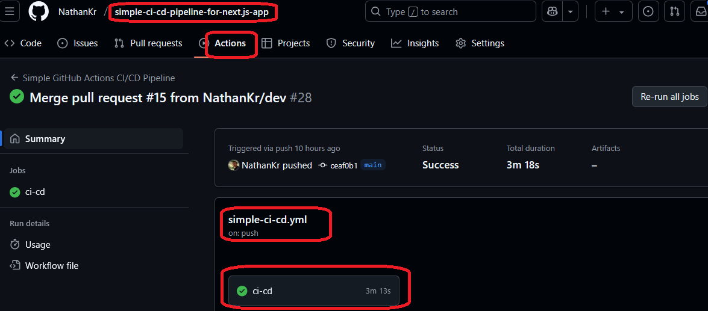
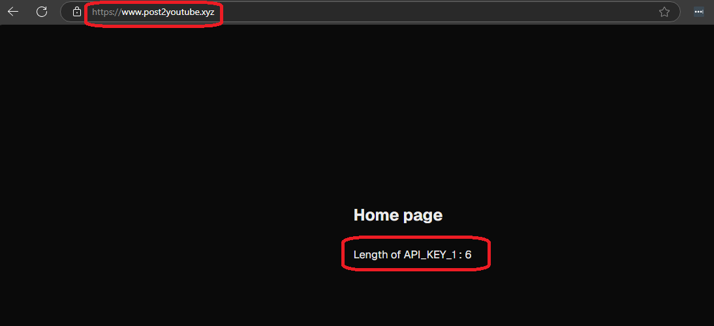

<h1>Project Name</h1>
Deploy next.js app on a VPS using github actions workflow


<h2>Description</h2>
This repository provides a simple workflow file to deploy your Next.js application to a VPS when pushing to the main branch. I use a DigitalOcean Droplet as the VPS, but the workflow is compatible with other types of VPS as well

<h2>Motivation</h2>
I already have a simple CI/CD workflow using GitHub Actions (<a href='#ref1'>[1]</a>), but I haven't applied it to a Next.js project yet. This guide demonstrates how to do that

<h2>Installation</h2>
<p>Below are the installation instructions for setting up the production server and configuring CI/CD:</p>


<h3>Production server</h3>
You need to setup the production server once as pre condition for success workflow. check <a href='#ref2'>[2]</a>


<h3>CI/CD</h3>
<ul>
<li>set VPS_IP ip and VPS_CICD_PRIVATE_KEY in the repo secrets part as in <a href='#ref1'>[1]</a></li>
<li>tweak <code>runs-on</code> to fit your production server operating system version (change from <code>ubuntu-latest</code> to <code>ubuntu-24.04</code> which best matches your production server version, which is Ubuntu 24.04)</li>
<li>.env.production: tweak the workflow file to load the environment variables; currently, we have

```yml
      echo 'API_KEY_1=${{ secrets.API_KEY_1 }}' > $NEW_WORKING_FOLDER/.env.production
```

</li>
</ul>


<h2>Usage</h2>
<ul>
  <li>Ensure the VPS is correctly set up with a production environment as described in the <a href="#ref2">Production Server</a> section.</li>
  <li>Push changes to the main branch of your GitHub repository to automatically trigger the deployment workflow via GitHub Actions.</li>
  <li>Verify that the <code>.env.production</code> file is generated and loaded with the necessary environment variables during the workflow execution.</li>
  <li>Monitor the GitHub Actions logs to ensure the deployment process completes successfully.</li>
  <li>Access the deployed Next.js application via the configured domain to verify its functionality.</li>
  <li>To debug or manually redeploy, use the <code>workflow_dispatch</code> event to trigger the workflow directly in the GitHub Actions interface.</li>
</ul>


<h2>Technologies Used</h2>
<p>The technologies used in this repository are listed below:</p>


<h3>Production server</h3>
<ul>
  <li>Nginx</li>
  <li>Domain</li>
  <li>https</li>
  <li>Linux on VPS - Ubuntu</li>
  <li>DigitalOcean - VPS provider using a droplet</li>
  <li>PM2</li>
</ul>


<h3>Development</h3>
<ul>
  <li>Next.js TypeScript project</li>
  <li>Vitest</li>
  <li>environment variables</li>
</ul>

<h3>CI/CD</h3>
<ul>
  <li>GitHub Actions</li>
  <li>GitHub</li>
  <li>Act</li>
</ul>

<h2>Design</h2>
<p>The design challenges I faced in this repository are listed below:</p>


<h3>Environment Variable Management</h3>

<p>A key challenge is securely managing environment variables for production. Next.js natively supports <code>.env.local</code> for development, and platforms like Vercel provide built-in variable management. However, for a VPS deployment, a different approach is needed.</p>

<p><strong>Problem:</strong> Next.js does not automatically load <code>.env.local</code> in production. While it does load <code>.env.production</code>, directly committing this file to the repository is a security risk, especially for sensitive data.</p>

<p><strong>Solution:</strong> Store the contents of <code>.env.production</code> as GitHub Actions secrets. During the deployment workflow, dynamically create the <code>.env.production</code> file on the VPS using these secrets. This ensures that sensitive information remains secure and is not exposed in the repository.</p>

<h3>Error Handling in GitHub Actions</h3>

<p>To control how GitHub Actions responds to non-zero exit codes (errors) in shell commands, you can use the following:</p>

```yml
set +e
# Commands that might fail but shouldn't stop the workflow
...
set -e
# Commands where failure should halt the workflow
```

<p>For more details, refer to <a href='#ref3'>[3]</a>.</p>

<h2>Code Structure</h2>

The workflow file - simple-ci-cd.yml is based on the one in <a href='#ref1'>[1]</a> with minor changes:

<table> 
<thead> 
<tr> <th>Step</th> <th>Current Workflow</th> <th><a href='#ref1'>[1]</a> Workflow</th> </tr> 
</thead> 
<tbody> 
<tr> <td>Runs-on Environment</td> <td>ubuntu-24.04</td> <td>ubuntu-latest</td> </tr> <tr> <td>Directory Variables</td> <td>HISTORY_WORKING_FOLDER</td> <td>OLD_WORKING_FOLDER</td> </tr>
<tr> <td>PM2 Commands</td> <td>Uses pm2 directly (e.g., pm2 stop)</td> <td>Uses npx pm2 (e.g., npx pm2 stop)</td> </tr> 
</tbody> 
</table>

Additionally, this workflow handles environment variables:

```yml
    - name: Create .env.production on VPS
      run: |
        ssh $USER@$VPS_IP "
          echo 'API_KEY_1=${{ secrets.API_KEY_1 }}' > $WORKING_FOLDER/.env.production
        "
```

  <h2>Demo</h2>
  <p>
    After your Next.js application is ready, you should push to the main branch and verify that the workflow completes successfully, as shown in the following image:
  </p>
  
  <p>
    This is the Next.js app running on the DigitalOcean droplet using the domain <a href="https://post2youtube.xyz" target="_blank">post2youtube.xyz</a>. I have used an environment variable with six characters.
  </p>
  


<h2>Points of Interest</h2>
<ul>
    <li><code>on: workflow_dispatch</code>: may be usefull during workflow development for manual workflow run . go to workflow file on github. click 'View Runs' and then click 'Run workflow'</li>
    <li>push to main trigger deploy, to protect this you can allow it only via pull request , this can be done via .git\hooks\pre-push (.git/hooks directory is not tracked by Git)

```bash
#!/bin/bash

branch_name=$(git rev-parse --abbrev-ref HEAD)

if [ "$branch_name" = "main" ]; then
  echo "Direct pushes to the 'main' branch are not allowed. Please create a pull request."
  exit 1
fi
```
  </li>
  <li>I initially started with a 1 GB RAM droplet, but it couldn't handle the build process and reached 100% CPU usage. Upgrading the droplet to 2 GB RAM solved the issue</li>
</ul>


<h2>References</h2>
<ol>
    <li id='ref1'><a href='https://youtu.be/sEBGmPZh75U?si=wUANX2Pu-Sk6iQxI'>Simplified CI/CD Workflow with GitHub Actions </a></li>
    <li id='ref2'><a href='https://youtu.be/yzbyCWkbcZA?si=_ftdj0fWMoGubTKI'>Deploy Next.js Application on DigitalOcean Droplet</a></li>
    <li id='ref3'><a href='https://youtu.be/ek8K3GLcrm4?si=ota-sa_lVReZTuyY'> Handling Non-Zero Exit Codes in GitHub Actions </a></li>
</ol>

